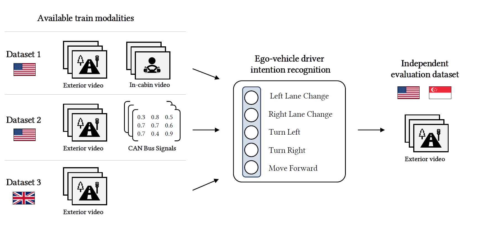

#  ECCV submission 1629: Learning ego-vehicle driving intentions from partially overlapping multi-modal datasets
The code and newly annotated NuScenes intention recognition labels accompanying our ECCV submission. 

## Start-up details
- pip install -r requirements.txt
- dataset pre-processing

## Datasets, Attribution & Licences 
- Brain4Cars: http://brain4cars.com/
- HDD: https://usa.honda-ri.com/hdd (requires university affiliation and e-mail to request access)
- ROAD / Oxford: https://github.com/gurkirt/road-dataset
- NuScenes: https://www.nuscenes.org/ (also available at https://registry.opendata.aws/motional-nuscenes/)

### Model zoo
Todo: check simple way to host the trained weights, too large to upload here.

### Example usage
Check the run.py script for a full overview of possibilities.
NuScenes intention labels are available in the _data/labels_ folder.
You can easily wrap the run scripts in a bash file to execute a number of folds or combinations.

`python run.py --model-type [model type] --datasets hdd b4c oxford ...`
